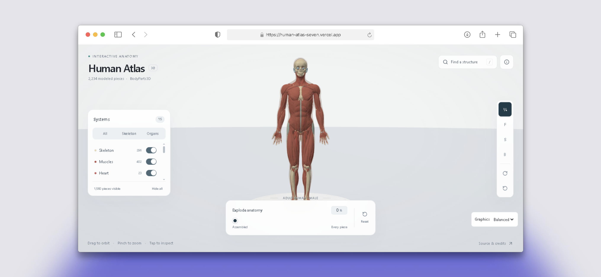

<div align="center">
    
    <br />
    <h1 align="center">
        
        Human Atlas
    </h1>

**An interactive 3D anatomy explorer built with React 19, Three.js, Tailwind CSS v4, and a Rust/WASM geometry engine.**

<p align="center">
    <a href="https://bun.sh">
        
    </a>
    <a href="https://react.dev">
        
    </a>
    <a href="https://www.rust-lang.org">
        
    </a>
    <a href="https://www.typescriptlang.org">
        
    </a>
    <a href="https://tailwindcss.com">
        
    </a>
    <a href="https://threejs.org">
        
    </a>
    <a href="LICENSE">
        
    </a>
</p>

</div>

Human Atlas is a browser-based anatomy explorer. Take the BodyParts3D adult male reference apart into **2,234 individually selectable meshes**, browse **15 anatomical systems**, and search **3,432 named concepts**. Geometry validation and render-ready packing run in a Web Worker backed by a Rust/WASM module, with an identical TypeScript fallback so the viewer always loads. Rendering updates only when the scene changes, so orbiting stays smooth without thousands of separate draw calls.

**[Explore the live demo](https://human-atlas-seven.vercel.app)**

## ✨ Features

- **2,234 selectable structures.** Every source mesh from BodyParts3D is individually indexed, pickable, and toggleable, merged into GPU batches with per-structure textures for translation, visibility, and selection.
- **Rust/WASM geometry engine.** A dedicated worker validates descriptors, checks byte ranges, and packs chunks into render-ready buffers. If WASM or the worker is unavailable, the TypeScript fallback produces identical output.
- **Search that actually works.** Search 3,432 anatomical names and source identifiers, with curated suggestions and nonmodal detail sheets.
- **Exploded inventory view.** Move from assembled anatomy to a spaced layout of every visible piece, packed only from visible parts at desktop and mobile aspect ratios.
- **Three quality profiles, one palette.** Low, Balanced, and High change resolution, antialiasing, and decorative stage detail, never anatomy colors. Low skips all unused decorative geometry allocations.
- **Built to be usable.** Keyboard controls, screen-reader announcements for loading and errors, compact mobile panels, and optional WebMCP tools for agent access.

## 🚀 Usage

### 1. Clone the repository

```bash
git clone https://github.com/sir-siren/human-atlas.git
cd human-atlas
```

### 2. Install dependencies

```bash
bun install --frozen-lockfile
```

### 3. Start the dev server

```bash
bun run dev
```

Then open `http://localhost:3016` in your browser.

### 4. Build for production

```bash
bun run build
```

This rebuilds the WASM engine first, then bundles the site into `dist/`.

### 5. Run tests and validation

```bash
bun run test              # Vitest suite (97 tests)
bun run check             # TypeScript compilation check
bun run lint              # Oxlint
bun run validate:all      # Full validation pipeline
```

### Engine commands

```bash
bun run engine:build      # wasm-pack release build into engine/pkg/
bun run engine:test       # Native cargo tests
bun run engine:check      # Clippy with warnings denied
```

Prerequisites: Bun 1.4.2+, Rust (pinned by `engine/rust-toolchain.toml`), and `wasm-pack 0.15.0`.

## 🎮 Controls

| Input / Action     | Interaction                        | Description                                     |
| :----------------- | :--------------------------------- | :---------------------------------------------- |
| **Mouse / Touch**  | Drag on the model                  | Orbits the camera around the body               |
| **Mouse / Touch**  | Click or tap a structure           | Selects it and opens the details sheet          |
| **Scroll / Pinch** | Scroll wheel or pinch              | Zooms in and out                                |
| **Search**         | Type in the search panel           | Filters anatomical names and source identifiers |
| **System Toggles** | Click a system in the layers panel | Shows or hides that anatomical system           |
| **Isolate**        | Select a structure, then isolate   | Hides everything except the selected piece      |
| **Explode**        | Use the explode control            | Spreads visible pieces into a spaced inventory  |

## 📊 Technical Specs & Constants

| Category           | Constant / Setting            | Default Value                | Location                          |
| :----------------- | :---------------------------- | :--------------------------- | :-------------------------------- |
| **Mesh Count**     | Indexed source meshes         | `2,234`                      | `public/models/atlas.json`        |
| **Concepts**       | Named anatomical concepts     | `3,432`                      | `public/models/atlas.json`        |
| **Triangles**      | Packaged model triangles      | `2,288,268`                  | `public/models/atlas.json`        |
| **Chunk Budget**   | `MAX_CHUNK_BYTES`             | `64 MiB` per chunk           | `engine/browser/engine-types.ts`  |
| **Worker Timeout** | Preparation job timeout       | `120,000ms`                  | `engine/browser/engine-client.ts` |
| **Tap Threshold**  | Pointer tap vs. drag distance | Euclidean, per-pointer       | `src/features/pointer-tap.ts`     |
| **Download Size**  | Compressed geometry           | ~`33 MB` gzip total          | `public/models/`                  |
| **WASM Engine**    | Optimized module size         | `25.66 KB` (`11.93 KB` gzip) | `engine/pkg/` (generated)         |
| **Dev Port**       | Vite dev server               | `3016`                       | `vite.config.ts`                  |

## 🔧 Customization

If you want to tweak things yourself, here's where to look:

- **Quality profiles (resolution, antialiasing, decorations):** `src/features/scene/render-quality.ts`
- **Exploded layout packing:** `src/features/explosion-layout.ts`
- **Search behavior:** `src/features/model/search-concepts.ts`
- **Geometry loading and worker protocol:** `engine/browser/`
- **Rust packing and validation:** `engine/crates/atlas-core/src/`
- **Asset optimization pipeline:** `scripts/optimize-anatomy.ts`, `scripts/compress-models.ts`

## 📄 License

MIT licensed. See the [LICENSE](LICENSE) file for the details.

Anatomy data is **BodyParts3D 4.0**, licensed **CC BY 4.0**. Full credits and adaptation details are in [ATTRIBUTION.md](public/ATTRIBUTION.md). This is an educational explorer, not a diagnostic or surgical tool.

## Rebuilding geometry

The repository includes browser-ready geometry. Rebuilding it is optional: obtain the official BodyParts3D OBJ archive and English metadata tables, prepare the joined concepts and display-system mappings, run `scripts/convert-anatomy.py`, then `bun scripts/optimize-anatomy.ts` and `bun scripts/compress-models.ts`. Simplification uses a 0.2% relative error limit per structure.

## Deploy

The production build requires Rust (the pinned toolchain in `engine/rust-toolchain.toml`) and wasm-pack 0.15.0 as well as Bun. Run `bun run engine:build` before starting development or running the WASM parity tests on a fresh checkout. `bun run build` builds the WASM package before Vite and emits both WASM and worker assets into `dist/`. Generated `engine/pkg/` and `engine/target/` are not committed. Use `bun run engine:test` and `bun run engine:check` for native checks.

For Vercel, the included `vercel.json` selects `bun install --frozen-lockfile`, `bun run build`, and `dist`. Configure the build environment with the pinned Rust target and wasm-pack first; a default Bun-only builder cannot build this version. Alternatively, build `dist/` in a configured CI environment and deploy it to a static host. Serve WASM as `application/wasm` and keep the generated worker/WASM assets with the matching JavaScript. Commit both `bun.lock` and `engine/Cargo.lock` for reproducibility. No SharedArrayBuffer or cross-origin isolation is required.

Geometry preparation runs in one worker with a scalar Rust/WASM kernel. Worker or WASM failures retain a TypeScript preparation path; this fallback preserves correctness, but may perform more main-thread work.

Issues and pull requests are welcome. Please include reproduction steps and browser/device details for interaction problems.

<div align="center">

**If you enjoy it, a star on GitHub goes a long way.** ⭐

</div>
